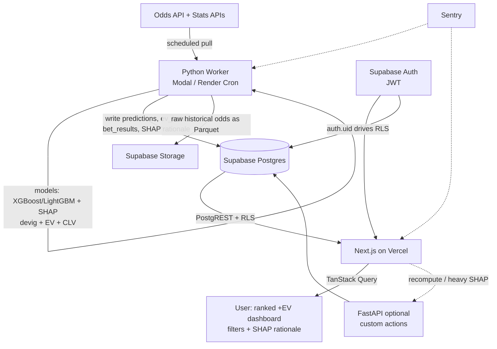

# Tech Stack Recommendation

**Prepared:** 2026-07-18
**Grounded in:** [`viability-analysis.md`](./viability-analysis.md) — a **decision-support** tool (never auto-places bets), starting as a **golf/props CLV + EV** vertical, expanding only if the CLV gate passes.

---

## TL;DR — the recommended stack

| Layer | Choice | One-line why |
|---|---|---|
| Frontend | **Next.js (React) + TypeScript**, responsive web-first | It's a sortable/filterable data dashboard; a responsive web app *is* cross-platform. React Native deferred to phase 2. |
| UI kit / table | **Tailwind + shadcn/ui + TanStack Table** | TanStack Table is purpose-built for the ranked, filterable +EV grid. |
| Server state | **TanStack Query** (+ Zustand for the little local UI state) | The app is 90% server state; don't reach for Redux. |
| Backend (ML/data) | **Python + FastAPI**, run as a **scheduled worker** | The entire quant stack (XGBoost, LightGBM, SHAP, devig math, your models) is Python. Node has no equivalent. **This decision drives the others.** |
| API style | **REST** — Supabase PostgREST for reads + FastAPI for custom actions | tRPC is off the table (Node-only; backend is Python). GraphQL is overkill. |
| Database | **Supabase (managed Postgres)** | Relational fits stats/odds/joins; bundles Auth + RLS + Storage + an **official MCP server**. Beats Firebase/Mongo decisively here. |
| Auth | **Supabase Auth** (JWT + Row-Level Security) | Free, integrated with the DB, no rolling-your-own. |
| Scheduled ML jobs | **Modal** (or Render Cron) | Serverless Python built for scheduled ML; generous free tier. |
| Frontend hosting | **Vercel Hobby** (or Cloudflare Pages) | Free at MVP, official MCP, best Next.js DX. |
| Object storage | **Supabase Storage** (Parquet for historical odds) | Keep bulk backtest data out of the serving DB. |
| Errors/observability | **Sentry** | Official MCP; triage worker + frontend errors from Claude Code. |

**Budget verdict:** MVP lands at **$0–37/month**, under your $50 cap. The dominant cost is **not hosting — it's the odds data API.** See §4.

---

## 1. Frontend

### Framework: Next.js (React) + TypeScript, web-first
Your product is a **read-heavy data dashboard**: ingest ranked bets, sort by EV, filter by sport/bet-type/threshold, show a 1–2 sentence SHAP rationale. That is a table-and-filters app, and a **responsive web app already covers mobile** — a phone browser renders it fine. So "cross-platform" does **not** require React Native on day one.

- **Recommendation:** [Next.js](https://nextjs.org/docs) with [React](https://react.dev) and TypeScript. You get file-based routing, server components for fast initial loads, and first-class [Vercel](https://vercel.com/docs) hosting + MCP.
- **Cheaper alternative:** [Vite](https://vite.dev) SPA on [Cloudflare Pages](https://developers.cloudflare.com/pages/) if you want to shave every dollar and don't need SSR. Perfectly valid; slightly more wiring.
- **React Native — defer to phase 2.** If you later want a true native app, use [Expo](https://docs.expo.dev/) and share a typed API-client package. Doing it now adds app-store review, native build tooling, and push-notification plumbing for a UI that a mobile browser already handles. Not worth it pre-revenue.

### Key libraries for our features
| Feature | Library | Doc |
|---|---|---|
| Ranked, sortable, filterable bet grid | **TanStack Table** | https://tanstack.com/table |
| Data fetching / caching / refetch | **TanStack Query** | https://tanstack.com/query |
| Styling + components | **Tailwind CSS** + **shadcn/ui** | https://tailwindcss.com/docs · https://ui.shadcn.com |
| Charts (EV history, CLV, calibration, SHAP bars) | **Recharts** (or visx) | https://recharts.org |
| DB/auth client in the browser | **supabase-js** | https://supabase.com/docs/reference/javascript |
| Filter forms | **React Hook Form** | https://react-hook-form.com |

### State management
Don't over-engineer this. The dashboard is **server state**, not client state.
- **TanStack Query** owns everything from the DB/API (the bets, results, user's tracked bets). It handles caching, background refresh, and staleness — which matters because +EV lines change.
- **Zustand** ([docs](https://zustand.docs.pmnd.rs/)) for the small amount of genuine UI state (active filters, selected sport). Light, no boilerplate.
- **Skip Redux.** There's no complex client-side state machine here.

---

## 2. Backend

### Runtime & framework: Python + FastAPI
This is the load-bearing decision. **The backend must be Python** because the value of the product lives entirely in Python libraries:

| Need | Python | Node |
|---|---|---|
| Gradient boosting | XGBoost, LightGBM (best-in-class) | thin/immature bindings |
| Explainability (your hard requirement) | **SHAP** — native, mature | effectively none |
| Devig / calibration / stats | numpy, scipy, scikit-learn, statsmodels | sparse |
| Reusing your existing models | direct | full rewrite |

- **Recommendation:** [**FastAPI**](https://fastapi.tiangolo.com/) — async, [Pydantic](https://docs.pydantic.dev/) validation, auto-generated OpenAPI (which becomes your typed TS client). Docs: FastAPI above; ML libs: [XGBoost](https://xgboost.readthedocs.io/), [LightGBM](https://lightgbm.readthedocs.io/), [scikit-learn](https://scikit-learn.org/stable/), [SHAP](https://shap.readthedocs.io/), [pandas](https://pandas.pydata.org/docs/).

### Architecture: a scheduled worker, not a request-driven server
The important insight: **most of your compute is a batch job, not an HTTP handler.** Structure it as two Python roles:

1. **Ingestion + modeling worker (scheduled, the heavy part):** pulls odds + stats → writes `odds_snapshots` → runs models → computes **de-vigged fair prob, EV, and CLV** → writes `predictions` / `ev_bets` + SHAP rationale to Postgres. Runs a few times daily on [Modal](https://modal.com/docs) or [Render Cron](https://render.com/docs/cronjobs).
2. **Thin FastAPI service (optional, small):** only for custom actions that can't be a plain DB read — e.g. "recompute now," serve a large SHAP payload, or a webhook. Can start at zero and grow.

Because Supabase auto-exposes a REST API over your tables, **the frontend reads results directly from Supabase** (RLS-protected) via TanStack Query. So you may not need a general-purpose API server at all early on — the worker fills tables, the client reads them. This is what keeps the bill near zero.

### API architecture: REST
- **Reads:** Supabase **PostgREST** (auto-generated REST over Postgres) + `supabase-js`. Zero code.
- **Custom actions:** REST endpoints on FastAPI, typed via its OpenAPI schema.
- **Not tRPC:** tRPC requires end-to-end **TypeScript**; our backend is Python, so it can't share types the way tRPC needs. (If the backend were Node, tRPC would be the pick — it isn't.)
- **Not GraphQL:** no client-shaped-query problem here; it's over-engineering for a ranked table.

### Authentication: Supabase Auth + RLS
Use [**Supabase Auth**](https://supabase.com/docs/guides/auth) (email/OAuth, JWT). Its killer feature is that the JWT drives [**Row-Level Security**](https://supabase.com/docs/guides/database/postgres/row-level-security) in Postgres — so when the frontend reads directly from the DB, **RLS policies are your authorization layer**. Public model outputs can be readable; a user's saved/tracked bets are scoped to `auth.uid()`. Don't build a bespoke auth system.

---

## 3. Database

### Primary: Supabase (managed Postgres)
Your viability analysis already called for a **relational** store, and that's correct: stats, odds snapshots, events, players, model runs, and bet results are highly relational and query-heavy (joins, aggregations, time-ordered reads). Scoring the three options you named:

| Option | Fit | Verdict |
|---|---|---|
| **Supabase (Postgres)** | Relational + Auth + RLS + Storage + PostgREST + **official MCP & Claude connector** + free tier | ✅ **Winner** |
| **Firebase (Firestore)** | Document/NoSQL; painful for the joins/aggregations and time-series this app is made of | ❌ Wrong data model |
| **MongoDB Atlas** | Document; has an MCP server, but no integrated Auth+RLS story and weaker for relational analytics | ❌ Not for this |

Docs: [Supabase](https://supabase.com/docs) · [Supabase CLI](https://supabase.com/docs/guides/cli). (Serverless-Postgres alternative if you ever outgrow Supabase's model: [Neon](https://neon.tech/docs), which also has an official MCP server.)

### Schema approach (normalized relational)
Sketch of core tables:
```
sports(id, name, ...)
events(id, sport_id, start_time, name, status, ...)
players(id, sport_id, name, external_ids jsonb, ...)
odds_snapshots(id, event_id, market, selection, book, price, captured_at)   -- time-series
model_runs(id, sport_id, model_version, trained_at, metrics jsonb)
predictions(id, model_run_id, event_id, selection, model_prob, novig_prob, ev, shap_top jsonb)
ev_bets(id, prediction_id, book, price, ev, kelly, flagged_at, status)      -- what the dashboard ranks
bet_results(id, ev_bet_id, closing_price, clv, settled_result)              -- CLV / performance tracking
user_bets(id, user_id, ev_bet_id, stake, placed_at)                         -- RLS-scoped to auth.uid()
```
- **Migrations as source of truth:** SQL migration files in git via the **Supabase CLI** (`supabase migration new` / `db push`). Reproducible, reviewable, MCP-friendly.
- **Time-series note:** `odds_snapshots` grows fast. Postgres is fine at MVP; add partitioning (by month) or TimescaleDB only when volume demands it. Don't pre-optimize.

### Secondary data stores
- **Cache — not needed at MVP.** Your precomputed `ev_bets` table *is* the cache; the worker does the expensive work offline. If you later need hot-path caching, add [Upstash Redis](https://upstash.com/docs/redis) (serverless, free tier). Don't add it now.
- **Object storage — yes, for backtests.** Store bulk **historical closing odds** (the CLV-gate data) as **Parquet in [Supabase Storage](https://supabase.com/docs/guides/storage)**, not in Postgres. Keeps the serving DB lean and cheap.
- **Search — not needed.** Postgres full-text search covers any "find a player/event" need later.

### Backup & migration strategy
- **Backups:** Supabase runs automated daily backups; **point-in-time recovery** is on the Pro plan. On the free tier, also run a scheduled `pg_dump` from the worker to object storage for safety.
- **Schema migrations:** Supabase CLI migration files in git (above). Never click-edit production schema — do it through migrations so it's reproducible and the dev/prod split (required by the MCP guidance) holds.

---

## 4. Infrastructure, Hosting & Cost

### Deployment
- **Frontend →** [Vercel](https://vercel.com/docs) Hobby (free) — best Next.js DX + official MCP. Or [Cloudflare Pages](https://developers.cloudflare.com/pages/) to minimize cost.
- **Scheduled Python worker →** [Modal](https://modal.com/docs) (serverless, built for scheduled ML, free credits) or [Render Cron Jobs](https://render.com/docs/cronjobs). For a light batch, even [GitHub Actions scheduled workflows](https://docs.github.com/en/actions/using-workflows/events-that-trigger-workflows#schedule) can run it near-free — watch runtime limits for heavy ML deps.
- **FastAPI (if/when needed) →** [Render](https://render.com/docs) web service ($7 always-on) or [Railway](https://docs.railway.com/) (usage-based).
- **DB/Auth/Storage →** Supabase.

### CI/CD
- **GitHub** + **[GitHub Actions](https://docs.github.com/en/actions)**: lint/test/type-check on PR; deploy frontend via Vercel's Git integration (auto), deploy worker via Modal/Render on merge to `main`. Supabase migrations applied in CI (`supabase db push`) against a dev project first.

### Estimated monthly cost
Ranges reflect the choose-cheaper-tier decisions above. **Verify current numbers at the linked pricing pages — they move.**

| Component | MVP (just you) | ~1k users | ~10k users |
|---|---|---|---|
| Frontend (Vercel Hobby → Pro) | $0 | $0–20 | $20 |
| Database (Supabase Free → Pro) | $0 | $25 | $25 + egress/compute overages |
| Python worker (Modal/Render) | $0–7 | $7–25 | $25–50 |
| FastAPI service (if used) | $0 | $0–7 | $7–25 |
| **Odds data API** ([The Odds API](https://the-odds-api.com/)) | **$0–30** | **$30–59** | **$59–119** |
| Sentry (errors) | $0 | $0–26 | $26 |
| **Total** | **≈ $0–37 ✅** | **≈ $62–135** | **≈ $162–290** |

**Honest callouts:**
- **The odds API is the real budget driver, not hosting.** The Odds API's free tier is **500 credits/month**, and a credit ≠ a request — one `/odds` call costs `markets × regions` credits, and historical calls cost **10×** ([pricing](https://the-odds-api.com/), [FAQ](https://the-odds-api.com/manage/faqs.html)). You **will** need a smart polling/caching schedule to stay in budget; naïve polling burns a paid tier in days. Historical data for the CLV gate is the priciest part.
- MVP stays comfortably **under $50**. The 1k-user tier crosses $50 — but per the viability doc you shouldn't be scaling users until CLV is proven, and by then there's revenue.
- **Egress at 10k users** (frontend reading Postgres directly) is the sneaky cost — paginate and pre-aggregate.

Pricing sources: [The Odds API](https://the-odds-api.com/) · [Render](https://render.com/pricing) · [Railway](https://railway.com/pricing) · [Supabase](https://supabase.com/pricing) · [Vercel](https://vercel.com/pricing).

---

## 5. MCP Server Availability

You asked to prioritize components with MCP servers for Claude Code. The recommended stack scores very well — **almost every layer has an official one:**

| Component | MCP server | Status | What it unlocks in Claude Code |
|---|---|---|---|
| **Supabase** | [Supabase MCP](https://supabase.com/docs/guides/ai-tools/mcp) | ✅ Official + **official Claude connector** (32 tools) | Create/alter tables, write & apply migrations, run SQL, manage branches — from chat |
| **Vercel** | [Vercel MCP](https://vercel.com/docs) | ✅ Official (OAuth 2.1, hosted) | Inspect deployments, env vars, read build/runtime logs |
| **GitHub** | [GitHub MCP](https://github.com/github/github-mcp-server) | ✅ Official (canonical since late 2025) | PRs, issues, Actions runs, code search |
| **Sentry** | [Sentry MCP](https://github.com/getsentry/sentry-mcp) (`https://mcp.sentry.dev/mcp`) | ✅ Official, GA | Pull errors + stack traces from the worker/frontend into a fix session |
| **Cloudflare** | [Cloudflare MCP](https://github.com/cloudflare/mcp-server-cloudflare) | ✅ Official | Only if you host on Pages/Workers |
| **Neon** (alt DB) | Neon MCP | ✅ Official | Relevant only if you pick Neon over Supabase |
| **The Odds API** | — | ❌ None | Plain REST; you wrap it yourself in the Python worker |
| **Modal** | — | ❌ None (as of now) | Manage via CLI/dashboard |

**What this enables for the dev workflow:** the two components you'll touch most during build — **the database schema and deployments** — are both driveable from Claude Code. Concretely: "add an `ev_bets` table with these columns and an RLS policy," "generate and apply the migration," "why did the last Vercel deploy fail," "show me today's worker errors in Sentry and propose a fix." That tight loop is a real reason to prefer this stack over a Firebase/Mongo path.

⚠️ **Security caveat (from Supabase's own guidance):** the Supabase MCP is for **development/testing, not production data.** Keep a separate dev Supabase project and point MCP at that. Never give an MCP server your production service-role key.

---

## 6. Integration Map



**Flow in words:** the scheduled Python worker pulls odds/stats → runs your models → computes de-vigged EV + CLV + a SHAP rationale → writes ranked `ev_bets` to Supabase Postgres. The Next.js dashboard reads those rows directly through PostgREST (guarded by RLS + Supabase Auth) and renders the sorted, filterable table. An optional thin FastAPI handles anything that isn't a plain read.

### Integration pain points (and mitigations)
1. **Python ↔ TypeScript type seam.** No tRPC across a Python/TS boundary. **Mitigate:** generate TS types from the DB (`supabase gen types typescript`) and from FastAPI's OpenAPI schema. This is the biggest DX seam — budget for it.
2. **Odds-API credit accounting.** `markets × regions` per call, 10× for historical — easy to blow the budget. **Mitigate:** a scheduling/caching layer in the worker; snapshot to `odds_snapshots` and never re-fetch the same window.
3. **RLS is your security perimeter.** Because the client reads Postgres directly, a wrong policy leaks data. **Mitigate:** default-deny, test policies explicitly, keep public-model vs. user-scoped tables clearly separated.
4. **Secrets & connection pooling for the worker.** Use the **service-role key server-side only**, never in the frontend bundle; connect through Supabase's **pooler (PgBouncer)** so batch jobs don't exhaust connections.
5. **Scheduled-job reliability.** Cold starts, timeouts on heavy ML, silent failures. **Mitigate:** Sentry on the worker, idempotent writes, alert if a run doesn't land.
6. **Egress/bandwidth at scale.** Direct client→Postgres reads get expensive with big result sets. **Mitigate:** server-side pagination, pre-aggregated `ev_bets`, and cache-control on API responses.
7. **Dev/prod split for MCP.** Supabase MCP must point at a dev project, not prod (see §5).

---

## What I would build in week 1
Consistent with the viability doc's "prove CLV before building the platform": **skip most of this stack initially.** Stand up only **Supabase (schema + Storage for historical Parquet)** and the **Python worker** to run the golf CLV harness. Add Next.js/Vercel/Auth/dashboard **only after** positive CLV. The stack above is what the product *becomes* — not what you build on day one.

---

### Sources
- [Supabase MCP is now an official Claude connector](https://supabase.com/blog/supabase-is-now-an-official-claude-connector) · [Supabase MCP docs](https://supabase.com/docs/guides/ai-tools/mcp)
- [Sentry MCP](https://github.com/getsentry/sentry-mcp) · [GitHub MCP](https://github.com/github/github-mcp-server) · [Cloudflare MCP](https://github.com/cloudflare/mcp-server-cloudflare)
- [The Odds API pricing](https://the-odds-api.com/) · [FAQ / credit costs](https://the-odds-api.com/manage/faqs.html)
- [Render vs Railway pricing 2026 (Encore)](https://encore.dev/articles/render-vs-railway) · [Render pricing](https://render.com/pricing) · [Railway pricing](https://railway.com/pricing)
- [Supabase pricing](https://supabase.com/pricing) · [Vercel pricing](https://vercel.com/pricing)
